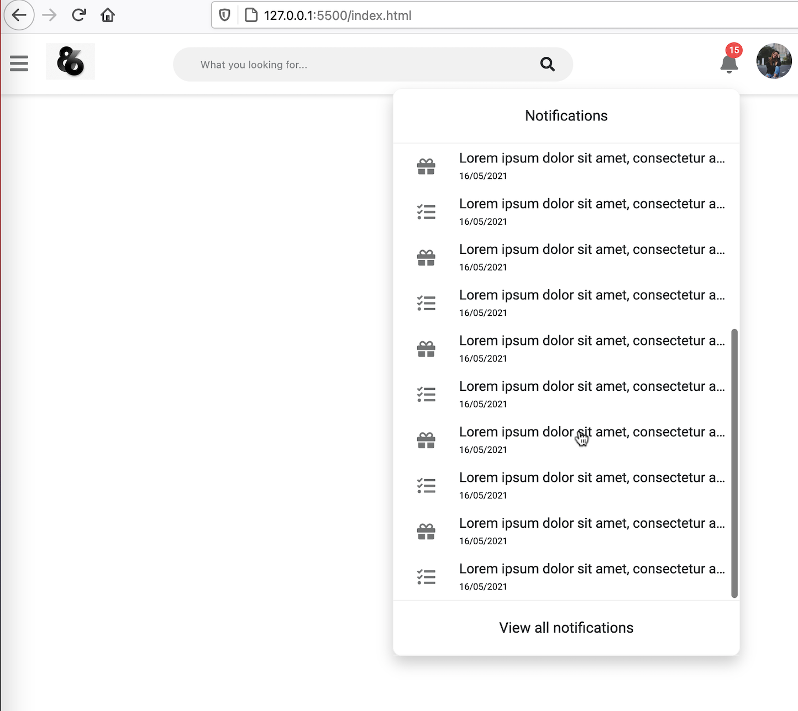
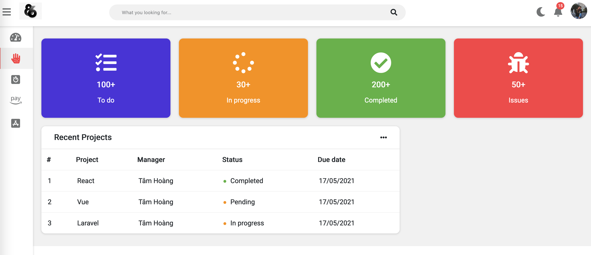

# Admin template Darkmode and Responsive


## Phần 1: Cài đặt ban đầu + Navbar:

### Sử dụng các thư viện

- chartjs
- fontawesome
- google font api

Import file css, js

```html
<link
  rel="stylesheet"
  href="https://cdn.jsdelivr.net/npm/chart.js@2.9.4/dist/Chart.min.css"
/>
<link rel="stylesheet" href="fontawesome-free/css/all.min.css" />
<link rel="preconnect" href="https://fonts.gstatic.com" />
<link
  href="https://fonts.googleapis.com/css2?family=Roboto&display=swap"
  rel="stylesheet"
/>

<link rel="stylesheet" href="style.css" />
<script
  src="https://cdn.jsdelivr.net/npm/chart.js@3.2.1/dist/chart.min.js"
  defer
></script>
<script src="index.js" defer></script>
```

### Chia layout


```
.navbar

.sidebar

.wrapper
```

### Navbar


#### HTML Navbar

```
.navbar
  ul.navbar-nav
    li.nav-item
      a.nav-link>i.fas.fa-bars
    li.nav-item
      img.logo

  form.navbar-search
    input.navbar-search-input
    i.fas.fa-search

  ul.navbar-nav.nav-right
    li.nav-item
      a.nav-link
        i.fas.fa-bell
        span.navbar-badge>{15}
    li.nav-item
      .avt
        img
```

#### CSS cho Navbar

1. Đặt các biến về màu sắc cho trang web

2. - css

3. css cho body

4. navbar dàn các item bên trong theo hàng ngang (display flex)

```css
.navbar {
  display: flex;
  flex-direction: row;
  background: var(--main-bg-color);
  color: var(--main-color);
  position: fixed;
  top: 0;
  left: 0;
  right: 0;
  z-index: 2;
  box-shadow: 0px 1px 4px 1px rgba(0, 0, 0, 0.12);
}
```

5. các nav-item bên trong navbar-nav dàn hàng ngang (display flex)

```css
.navbar-nav {
  display: flex;
  flex-direction: row;
}
```

6. Các thẻ a nav-link có khoảng cách

```css
.nav-link {
  color: var(--second-color);
  font-size: 17px;
  text-align: center;
  display: inline-block;
  padding: 21px 10px;
}
.nav-link:hover {
  cursor: pointer;
}
.navbar-nav i {
  font-size: 1.4rem;
}
```

7. navbar-nav nằm sát bên phải
   (Một cách dùng margin auto bên trong display flex)

```css
.navbar-nav.nav-right {
  margin-left: auto;
}
```

8. Căn giữa form search
   (Dùng margin auto)

```css
.navbar-search {
  position: relative;
  width: 50%;
  margin: auto;
}
```

9. css cho ô nhập input

- Màu nền
- Bo góc
- Padding

```css
.navbar-search input {
  color: var(--main-color);
  padding: 12px 50px;
  width: 100%;
  background: var(--second-bg-color);

  outline: none;
  border: none;
  border-radius: 20px;
}
```

10. Chỉnh vị trí icon search vào trong ô input
    (Dùng position absolute để tách layer icon search, tuy nhiên, phải cho thẻ chứa nó trực tiếp, có position relative để làm khung neo)

```css
.navbar-search i {
  color: var(--main-color);
  cursor: pointer;

  position: absolute;
  top: 50%;
  right: 20px;
  transform: translateY(-50%);
}
```

11. Căn chỉnh style cho 2 tấm hình logo và avatar
    (Chỉ cần dùng width, height và bo tròn 50%)

    Để hình ko phải hình vuông không bị méo, thì dùng thuộc tính object-fit cover

```css
.logo {
  height: 60px;
  padding: 10px;
}
.avt {
  padding: 10px;
}
.avt img {
  width: 39px;
  height: 39px;
  border-radius: 50%;
  object-fit: cover;
}
```

12. Style cho notification

- Màu sắc
- Font chữ
- Vị trí (position absolute) => nav-link phải có position relative

```css
.navbar-badge {
  font-size: 0.6rem;
  padding: 3px 4px;

  position: absolute;
  right: 5px;
  top: 9px;

  color: #fff;
  background-color: var(--danger-color);
  border-radius: 50%;
}
```

### Dropdown-menu Notifications



#### HTML dropdown menu

```
ul.navbar-nav.nav-right
    li.nav-item.dropdown
      a.nav-link
        i.fas.fa-bell.dropdown-toggle[data-toggle="notification-menu"]
        span.navbar-badge>{15}


      ul#notification-menu.dropdown-menu.notification-menu
        .dropdown-menu-header
          span>{Notifications}

        .dropdown-menu-content
          li.dropdown-menu-item
            a.dropdown-menu-link
              div
                i.fas.fa-gift
              span
                {lorem*16}
                <br/>
                span>{16/05/2021}

        .dropdown-menu-footer
          span>{View all notifications}
```

#### CSS dropdown menu

Dropdown menu có 3 phần: header, footer, và content ở giữa.

1. Tạo điểm neo cho dropdown menu (là thẻ li dropdown chứa nó)

```css
.dropdown {
  position: relative;
}
.dropdown:hover {
  cursor: pointer;
}
```

2. Dropdown menu là 1 layer mới. (Dùng position absolute)

- Có độ rộng tối đa 300px
- z-index cao hơn những layer hiện tại
- 1 số style khác cho dropdown menu nổi bật ( bg, border, box-shadow...)

```css
.dropdown-menu {
  position: absolute;
  right: 20%;
  top: 90%;

  max-width: 300px;
  background-color: var(--main-bg-color);
  box-shadow: 0 8px 16px 0px rgba(0, 0, 0, 0.2);
  border-radius: 10px;
  border: 0.125px solid var(--second-bg-color);
  z-index: 3;
}
```

3. CSS cho dropdown menu header, và footer

Căn giữa nội dung

Chỉ định một chút padding và có border

```css
.dropdown-menu-header,
.dropdown-menu-footer {
  padding: 20px;
  text-align: center;
  border-bottom: 1px solid var(--second-bg-color);
}
.dropdown-menu-footer {
  border-top: 1px solid var(--second-bg-color);
}
```

4. CSS cho div.dropdown-menu-content

- Chiều cao tối đa 500px, nếu vượt quá sẽ hiển thị thanh cuộn scroll theo trục y.

```css
.dropdown-menu-content {
  max-height: 500px;
  overflow-y: auto;
}
```

5. CSS cho li.dropdown-menu-item

- Độ rộng 100% thẻ cha chứa nó

```css
.dropdown-menu-item {
  width: 100%;
}
```

6. CSS cho a.dropdown-menu-link
   Gồm 3 thành phần:

- icon gói quà (div > i)
- text nội dung thông báo (span)
- text thời gian (span > span)

Cho 3 thành phần nằm hàng ngang (thẻ cha sẽ display flex)

```css
.dropdown-menu-link {
  display: flex;
  flex-direction: row;
  align-items: center;
  color: var(--main-color);
}
.dropdown-menu-link:hover {
  cursor: pointer;
}
```

7. CSS cho icon gift

- Căn giữa trái phải, trên dưới
- Độ rộng tối thiểu 82px
- Chiều cao 50px

```css
.dropdown-menu-link div {
  position: relative;
  min-width: 82px;
  height: 50px;
}
.dropdown-menu-link i {
  font-size: 1.25rem;
  color: var(--second-color);
  position: absolute;
  left: 50%;
  top: 50%;
  transform: translate(-50%, -50%);
}
```

8. CSS cho text nội dung thông báo (span)

- Chiếm full width còn lại, sau khi trừ đi độ rộng của thẻ icon gift
- Chữ dư thừa sẽ đổi thành dấu ...
- Căn giữa theo trục y

```css
.dropdown-menu-link span {
  font-size: 15px;
  width: 298px;
  white-space: nowrap;
  overflow: hidden;
  text-overflow: ellipsis;
}
```

9. CSS cho text thời gian ( span > span)

Chữ nhỏ hơn text thông báo một chút.

```css
.dropdown-menu-link span > span {
  font-size: 10px;
}
```

### Dropdown-menu User

Chỉ cần tạo html giống với dropdown-menu notification, là sẽ apply được các css.

```
li.nav-item
  .avt.dropdown
    img.dropdown-toggle[data-toggle="user-menu"]

    ul#user-menu.dropdown-menu
      li.dropdown-menu-item
        a.dropdown-menu-link
          div
            i.fas.fa-user-tie
          span>{Profile}
      li.dropdown-menu-item
        a.dropdown-menu-link
          div
            i.fas.fa-cog
          span>{Settings}
      li.dropdown-menu-item
        a.dropdown-menu-link
          div
            i.fas.fa-money-check
          span>{Payments}
      li.dropdown-menu-item
        a.dropdown-menu-link
          div
            i.fas.fa-code-branch
          span>{Projects}
      li.dropdown-menu-item
        a.dropdown-menu-link
          div
            i.fas.fa-sign-out-alt
          span>{Logout}
```

### Javascript cho dropdown menu

User bấm vào notification => hiển thị notification menu

User bấm vào Hình avartar => Hiển thị user menu

Nếu có dropdown menu nào đang mở:

- Nếu user click ra ngoài dropdown menu thì tắt dropdown menu
- Nếu user bấm phím ESC thì cũng tắt dropdown menu

## Phần 2: Sidebar + Main content

Sidebar có 2 loại, loại thu nhỏ, và loại mở rộng

content sẽ chiếm nửa bên phải còn lại.

### Sidebar

#### CSS cho section sidebar

Mặc định là sidebar loại nhỏ, khi hover vào sẽ biến thành sidebar loại mở rộng.

Độ rộng của sidebar loại nhỏ là 82px

```css
.sidebar {
  width: 82px;
  height: 100vh;

  position: fixed;
  margin-top: 65px;
  background-color: var(--main-bg-color);
  box-shadow: var(--box-shadow);
  z-index: 4;
}
```

Khi hover qua side loại nhỏ, thì cho độ rộng của sidebar tăng lên 250px

```css
.sidebar:hover {
  width: 250px;
}
```

#### CSS cho sidebar-nav

Cho toàn bộ item bên trong hiển thị theo chiều dọc (display flex, flex-direction là column)

```css
.sidebar-nav {
  display: flex;
  flex-direction: column;
  align-items: center;
  height: 100%;
}
```

#### CSS cho sidebar-nav-item

Từng item chiếm full width, và chiều cao 50px

Khi item được active (đang được chọn) thì có border danger bên trái

```css
.sidebar-nav-item {
  width: 100%;
}
```

#### CSS cho a.sidebar-nav-link

```css
.sidebar-nav-link {
  display: flex;
  align-items: center;
  color: var(--main-color);
}
```

Bao gồm 2 phần:

- icon
- Tiêu đề chức năng

```css
.sidebar-nav-link div {
  min-width: 82px;
  height: 50px;
  position: relative;
}
.sidebar-nav-link i {
  font-size: 1.5rem;
  color: var(--second-color);
  position: absolute;
  left: 50%;
  top: 50%;
  transform: translate(-50%, -50%);
}
```

Bao gồm 2 hiệu ứng:

- Không active
- Hover qua đổi bg
- Active: màu danger cho icon và border left

```css
.sidebar-nav-link:hover {
  background-color: var(--second-bg-color);
  border-left: 5px solid var(--danger-color);
}

.sidebar-nav-link.active {
  background-color: var(--second-bg-color);
}
.sidebar-nav-link:hover i,
.sidebar-nav-link.active i {
  color: var(--danger-color);
  margin-left: -5px;
}
```

#### CSS cho .wrapper của phần content

```css
.wrapper {
  margin-left: 82px;
  padding: 10px;
  padding-top: 75px;
  background-color: var(--second-bg-color);
}
```

#### Khi hover vào sidebar, sidebar được mở rộng, nhưng làm sao để phần content dịch sang phải 1 khoảng đúng bằng sidebar mở rộng?

1. Gán class sidebar-expand cho thẻ body

2. Nếu body có class sidebar-expand thì, thẻ .wrapper sẽ margin left 250px.

3. Nếu body không có class sidebar-expand, thì thẻ .wrapper sẽ margin left 82px.

```
body.sidebar-expand
```

```css
body.sidebar-expand .sidebar {
  width: 250px;
}
body.sidebar-expand .wrapper {
  margin-left: 250px;
}
```

Khi bấm vào menu trên navbar thì sidebar expand mở ra.

Gắn sự kiện onclick và viết hàm collapseSidebar
File js

```js
const body = document.body;

function collapseSidebar() {
  body.classList.toggle("sidebar-expand");
}
```

## Phần 3: Darkmode

Logic để làm 2 chế độ màu cho 1 trang web:

- Đặt các biến chứa giá trị màu (light và dark)
- Đặt các biến chứa tên màu
- Sau đó, ở mỗi nơi liên quan đến màu nền + màu chữ, thay vì dùng giá trị màu trực tiếp, thì dùng qua biến chứa tên màu.

1. Tạo các biến

```css
--light-color: #212529;
--light-second-color: #727475;
--light-bg: #fff;
--light-second-bg: #f1f1f1;
```

```css
--dark-color: #909090;
--dark-second-color: #f5f6fa;
--dark-bg: #23242d;
--dark-second-bg: #181818;
```

```css
--main-bg-color: var(--light-bg);
--second-bg-color: var(--light-second-bg);
--main-color: var(--light-color);
--second-color: var(--light-second-color);
```

2. tạo 2 class đại diện cho 2 theme

```css
.light {
  --main-bg-color: var(--light-bg);
  --second-bg-color: var(--light-second-bg);
  --main-color: var(--light-color);
  --second-color: var(--light-second-color);
}
.dark {
  --main-bg-color: var(--dark-bg);
  --second-bg-color: var(--dark-second-bg);
  --main-color: var(--dark-color);
  --second-color: var(--dark-second-color);
}
```

3. Tạo nút chuyển đổi theme
   Tạo thêm 1 nav-item ở navbar-right

```html
<li class="nav-item">
  <a class="nav-link" href="javascript:;" onclick="switchTheme();">
    <i class="fas fa-moon"></i>
  </a>
</li>
```

4. Dùng javascript để gán tên class cho body

Dùng cookie để lưu giá trị theme mà user đã chọn, nếu user mới vào website lần đầu chưa có cookie thì mặc định theme là light.

Hàm setCookie

```js
const themeCookieName = "theme";
const themeDark = "dark";
const themeLight = "light";

function setCookie(cname, cvalue, exdays) {
  let d = new Date();
  d.setTime(d.getTime() + exdays * 24 * 60 * 60 * 1000);

  let expires = "expires=" + d.toUTCString();

  document.cookie = cname + "=" + cvalue + ";" + expires + ";path=/";
}
```

Hàm getCookie

```js
function getCookie(cname) {
  let name = cname + "=";
  let ca = document.cookie.split(";");

  for (let i = 0; i < ca.length; i++) {
    let c = ca[i];
    while (c.charAt(0) == " ") {
      c = c.substring(1);
    }
    if (c.indexOf(name) == 0) {
      return c.substring(name.length, c.length);
    }
  }
  return "";
}
```

Hàm loadTheme và switchTheme

```js
function loadTheme() {
  let theme = getCookie(themeCookieName);
  body.classList.add(theme === "" ? themeLight : theme);
}
function switchTheme() {
  if (body.classList.contains(themeLight)) {
    body.classList.remove(themeLight);
    body.classList.add(themeDark);

    setCookie(themeCookieName, themeDark);
  } else {
    body.classList.remove(themeDark);
    body.classList.add(themeLight);

    setCookie(themeCookieName, themeLight);
  }
}
loadTheme();
```

## Phần 4: Responsive

Tạo cấu trúc lưới bằng class col-\*, và các thuộc tính width.

```css
[class*="col-"] {
  padding: 10px;
}
```

Chia làm 4 loại màn hình

- Màn hình nhỏ nhất (<600px>): ẩn sidebar, và wrapper có margin left là 0.
- Màn hình nhỏ (< 768px>)
- Màn hình trung bình ( < 992px>)
- Màn hình lớn ( < 1200px>)
- Màn hình lớn nhất ( > 1200px)

```css
/* extra small device <= 600px */
@media only screen and (max-width: 599px) {
  .sidebar {
    width: 0px;
  }
  .wrapper {
    margin-left: 0;
  }

  [class*="col-"] {
    width: 100%;
  }
  .col-xs-1 {
    width: 8.33%;
  }
  .col-xs-2 {
    width: 16.66%;
  }
  .col-xs-3 {
    width: 25%;
  }
  .col-xs-4 {
    width: 33.33%;
  }
  .col-xs-5 {
    width: 41.66%;
  }
  .col-xs-6 {
    width: 50%;
  }
  .col-xs-7 {
    width: 58.33%;
  }
  .col-xs-8 {
    width: 66.66%;
  }
  .col-xs-9 {
    width: 75%;
  }
  .col-xs-10 {
    width: 83.33%;
  }
  .col-xs-11 {
    width: 91.66%;
  }
  .col-xs-12 {
    width: 100%;
  }
}
/* small device >= 600px */
@media only screen and (min-width: 600px) {
  [class*="col-"] {
    width: 100%;
  }
  .col-sm-1 {
    width: 8.33%;
  }
  .col-sm-2 {
    width: 16.66%;
  }
  .col-sm-3 {
    width: 25%;
  }
  .col-sm-4 {
    width: 33.33%;
  }
  .col-sm-5 {
    width: 41.66%;
  }
  .col-sm-6 {
    width: 50%;
  }
  .col-sm-7 {
    width: 58.33%;
  }
  .col-sm-8 {
    width: 66.66%;
  }
  .col-sm-9 {
    width: 75%;
  }
  .col-sm-10 {
    width: 83.33%;
  }
  .col-sm-11 {
    width: 91.66%;
  }
  .col-sm-12 {
    width: 100%;
  }
}
/* medium device >= 768px */
@media only screen and (min-width: 768px) {
  .col-m-1 {
    width: 8.33%;
  }
  .col-m-2 {
    width: 16.66%;
  }
  .col-m-3 {
    width: 25%;
  }
  .col-m-4 {
    width: 33.33%;
  }
  .col-m-5 {
    width: 41.66%;
  }
  .col-m-6 {
    width: 50%;
  }
  .col-m-7 {
    width: 58.33%;
  }
  .col-m-8 {
    width: 66.66%;
  }
  .col-m-9 {
    width: 75%;
  }
  .col-m-10 {
    width: 83.33%;
  }
  .col-m-11 {
    width: 91.66%;
  }
  .col-m-12 {
    width: 100%;
  }
}
/* laptops >= 992px */
@media only screen and (min-width: 992px) {
  .col-1 {
    width: 8.33%;
  }
  .col-2 {
    width: 16.66%;
  }
  .col-3 {
    width: 25%;
  }
  .col-4 {
    width: 33.33%;
  }
  .col-5 {
    width: 41.66%;
  }
  .col-6 {
    width: 50%;
  }
  .col-7 {
    width: 58.33%;
  }
  .col-8 {
    width: 66.66%;
  }
  .col-9 {
    width: 75%;
  }
  .col-10 {
    width: 83.33%;
  }
  .col-11 {
    width: 91.66%;
  }
  .col-12 {
    width: 100%;
  }
}
/* large desktop >= 1200px */
@media only screen and (min-width: 1200px) {
  .col-lg-1 {
    width: 8.33%;
  }
  .col-lg-2 {
    width: 16.66%;
  }
  .col-lg-3 {
    width: 25%;
  }
  .col-lg-4 {
    width: 33.33%;
  }
  .col-lg-5 {
    width: 41.66%;
  }
  .col-lg-6 {
    width: 50%;
  }
  .col-lg-7 {
    width: 58.33%;
  }
  .col-lg-8 {
    width: 66.66%;
  }
  .col-lg-9 {
    width: 75%;
  }
  .col-lg-10 {
    width: 83.33%;
  }
  .col-lg-11 {
    width: 91.66%;
  }
  .col-lg-12 {
    width: 100%;
  }
}
```

## Phần 5: Content

### Row 1: 4 khối counter

1. Nằm trong cùng 1 row, và flex wrap

```html
<div class="col-3 col-m-6 col-sm-6">
  <div class="counter bg-success">
    <p><i class="fas fa-check-circle"></i></p>
    <h3>200+</h3>
    <p>Completed</p>
  </div>
</div>
```

2. css cho counter

```css
.counter {
  padding: 16px;
  text-align: center;
  color: #fff;
  border-radius: 10px;
  box-shadow: var(--box-shadow);
}
.counter > * {
  margin: 16px;
}
.counter i {
  font-size: 50px;
}
```

### Row 2: 8 - 4

#### CSS cho card



1. Card

```css
.card {
  background: var(--main-bg-color);
  color: var(--main-color);
  border-radius: 10px;
  margin-bottom: 10px;
  box-shadow: var(--box-shadow);
}
```

2. Card header

```css
.card-header {
  padding: 15px 30px;
  border-bottom: 1px solid var(--second-bg-color);
  position: relative;
}
.card-header i {
  color: var(--main-color);
  position: absolute;
  right: 30px;
  top: 50%;
  transform: translateY(-50%);
}
.card-header i:hover {
  cursor: pointer;
}
.card-header h3 {
  margin: 0;
}
```

3. CSS cho card-content

```css
.card-content {
  padding: 20px;
  overflow-x: auto;
}
```

#### CSS cho table

1. Table và thẻ table head

```css
table {
  width: 100%;
  border-collapse: collapse;
}
table td {
  border-top: 1px solid var(--second-bg-color);
  padding: 15px;
}
table th {
  border-top: 1px solid var(--second-bg-color);
  padding: 15px 12px;
  text-align: left;
}
```

#### CSS cho nút chấm (.dot i)

```css
.dot i {
  display: inline-block;
  width: 0.385rem;
  height: 0.385rem;
  margin-right: 0.385rem;
  vertical-align: middle;
  border-radius: 50%;
}
```

#### CSS cho card 2

1. html

```
.col-4
  .card
    .card-header
      h3>{Average time solving an issue}
      i.fas.fa-ellipsis-h

    .card-content
      .progress-wrapper
        p
          {Less than 1 hour}
          span.float-right>{50%}
        .progress
          .bg-success
```

2. CSS cho thanh progress

```css
.progress-wrapper {
  margin-bottom: 15px;
}
.float-right {
  float: right;
}
.progress {
  margin-top: 10px;
  height: 10px;
  overflow: hidden;
  display: flex;
  font-size: 0.75rem;
  background: rgba(0, 0, 0, 0.05);
  border-radius: 0.25rem;
  box-shadow: inset 0 1px 2px rgba(0, 0, 0, 0.1);
}
```

### Row 3: Chart js
