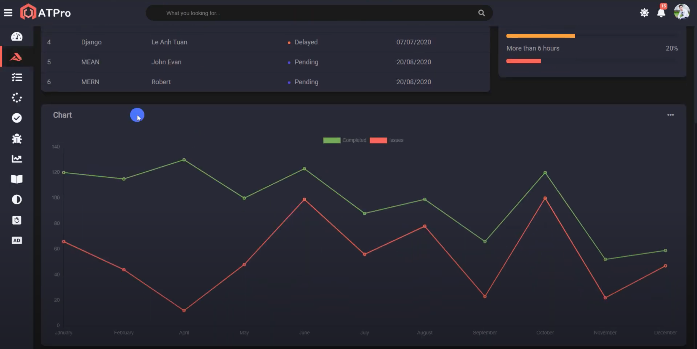
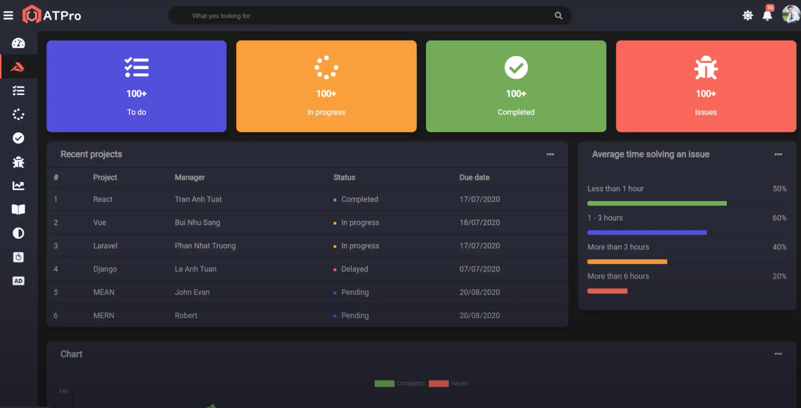
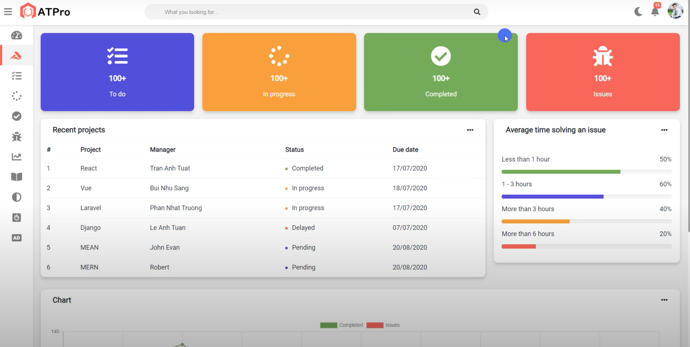
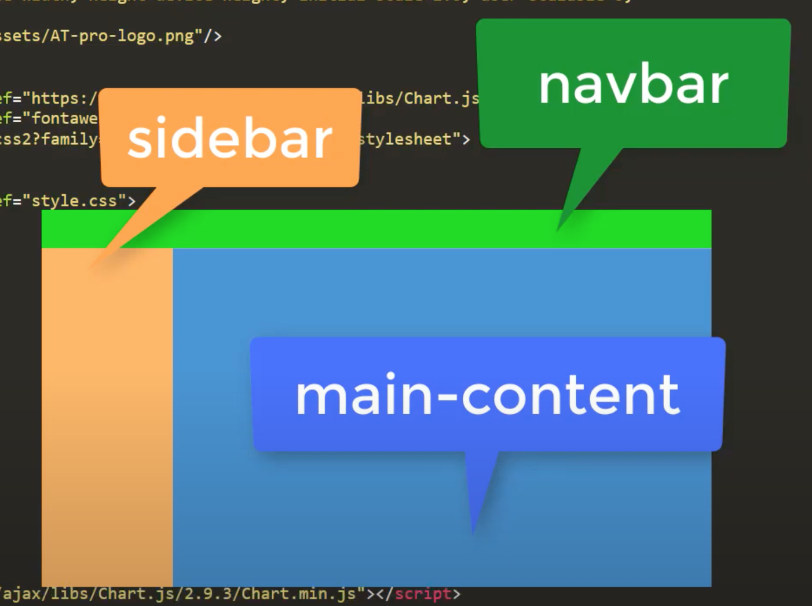

# Admin template Darkmode and Responsive





## HTML:

### Sử dụng các thư viện

- chartjs
- fontawesome
- google font api

Import file css, js

```html
<link
  rel="stylesheet"
  href="https://cdn.jsdelivr.net/npm/chart.js@2.9.4/dist/Chart.min.css"
/>
<link rel="stylesheet" href="fontawesome-free/css/all.min.css" />
<link rel="preconnect" href="https://fonts.gstatic.com" />
<link
  href="https://fonts.googleapis.com/css2?family=Roboto&display=swap"
  rel="stylesheet"
/>

<link rel="stylesheet" href="style.css" />
<script
  src="https://cdn.jsdelivr.net/npm/chart.js@3.2.1/dist/chart.min.js"
  defer
></script>
<script src="index.js" defer></script>
```

### Chia layout



```
.navbar

.sidebar

.wrapper
```

### Navbar


#### HTML Navbar

```
.navbar
  ul.navbar-nav
    li.nav-item
      a.nav-link>i.fas.fa-bars
    li.nav-item
      img.logo

  form.navbar-search
    input.navbar-search-input
    i.fas.fa-search

  ul.navbar-nav.nav-right
    li.nav-item
      a.nav-link
        i.fas.fa-bell
        span.navbar-badge>{15}
    li.nav-item
      .avt
        img
```

#### CSS cho Navbar

1. Đặt các biến về màu sắc cho trang web

2. - css

3. css cho body

4. navbar dàn các item bên trong theo hàng ngang (display flex)

```css
.navbar {
  display: flex;
  flex-direction: row;
  background: var(--main-bg-color);
  color: var(--main-color);
  position: fixed;
  top: 0;
  left: 0;
  right: 0;
  z-index: 2;
  box-shadow: 0px 1px 4px 1px rgba(0, 0, 0, 0.12);
}
```

5. các nav-item bên trong navbar-nav dàn hàng ngang (display flex)

```css
.navbar-nav {
  display: flex;
  flex-direction: row;
}
```

6. Các thẻ a nav-link có khoảng cách

```css
.nav-link {
  color: var(--second-color);
  font-size: 17px;
  text-align: center;
  display: inline-block;
  padding: 21px 10px;
}
.nav-link:hover {
  cursor: pointer;
}
.navbar-nav i {
  font-size: 1.4rem;
}
```

7. navbar-nav nằm sát bên phải
   (Một cách dùng margin auto bên trong display flex)

```css
.navbar-nav.nav-right {
  margin-left: auto;
}
```

8. Căn giữa form search
   (Dùng margin auto)

```css
.navbar-search {
  position: relative;
  width: 50%;
  margin: auto;
}
```

9. css cho ô nhập input

- Màu nền
- Bo góc
- Padding

```css
.navbar-search input {
  color: var(--main-color);
  padding: 12px 50px;
  width: 100%;
  background: var(--second-bg-color);

  outline: none;
  border: none;
  border-radius: 20px;
}
```

10. Chỉnh vị trí icon search vào trong ô input
    (Dùng position absolute để tách layer icon search, tuy nhiên, phải cho thẻ chứa nó trực tiếp, có position relative để làm khung neo)

```css
.navbar-search i {
  color: var(--main-color);
  cursor: pointer;

  position: absolute;
  top: 50%;
  right: 20px;
  transform: translateY(-50%);
}
```

11. Căn chỉnh style cho 2 tấm hình logo và avatar
    (Chỉ cần dùng width, height và bo tròn 50%)

    Để hình ko phải hình vuông không bị méo, thì dùng thuộc tính object-fit cover

```css
.logo {
  height: 60px;
  padding: 10px;
}
.avt {
  padding: 10px;
}
.avt img {
  width: 39px;
  height: 39px;
  border-radius: 50%;
  object-fit: cover;
}
```

12. Style cho notification

- Màu sắc
- Font chữ
- Vị trí (position absolute) => nav-link phải có position relative

```css
.navbar-badge {
  font-size: 0.6rem;
  padding: 3px 4px;

  position: absolute;
  right: 5px;
  top: 9px;

  color: #fff;
  background-color: var(--danger-color);
  border-radius: 50%;
}
```

### Dropdown-menu Navbar

#### HTML dropdown menu

```
ul.navbar-nav.nav-right
    li.nav-item.dropdown
      a.nav-link
        i.fas.fa-bell
        span.navbar-badge>{15}


      ul.dropdown-menu
        .dropdown-menu-header
          span>{Notifications}

        .dropdown-menu-content
          li.dropdown-menu-item
            a.dropdown-menu-link
              div
                i.fas.fa-gift
              span>{lorem*16}
              span>{16/05/2021}

        .dropdown-menu-footer
          span>{View all notifications}
```
